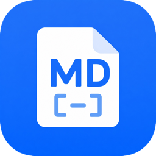

<p align="center">
  
</p>

# Markdown Viewer 📝

一款简约的 Android Markdown 文件查看器。

## 功能

- 📂 通过系统文件选择器打开 `.md` 文件
- 🔗 支持从其他 App 分享 `.md` 文件直接查看
- ✨ Markdown 渲染：标题、粗体、斜体、列表、代码块、表格、删除线
- 🌙 深色/浅色主题（跟随系统）
- 🎨 Material Design 3 + Material You 动态主题 (Android 12+)
- ⚡ 主题切换不丢失滚动位置

## 技术栈

- **Kotlin** + **Jetpack Compose**
- **Markwon** — Markdown 渲染引擎
- **Material 3** — 设计系统

## 构建

```bash
./gradlew assembleDebug
```

APK 输出：`app/build/outputs/apk/debug/app-debug.apk`

## 下载

最新版本：[v1.4.0](https://github.com/zhanxin-xu/md-viewer/releases/tag/v1.4.0)

## 更新日志

| 版本 | 日期 | 更新内容 |
|------|------|----------|
| v1.4.0 | 2026-04-29 | ♻️ 重构：抽取 FileUtils、修复 setMarkdown 性能、onNewIntent、Toast 提示 |
| v1.3.0 | 2026-04-28 | ♿ Fling 滚动 + 无限缩放 |
| v1.2.0 | 2026-04-28 | 📝 完善表格样式 + test markdown |
| v1.1.0 | 2026-04-28 | 🎨 修复白色背景、添加双指缩放 |
| v1.0.0 | 2026-04-28 | 🎉 初始版本 |

## 截图

*(待添加)*

---

Made with ❤️ by zhanxin-xu
